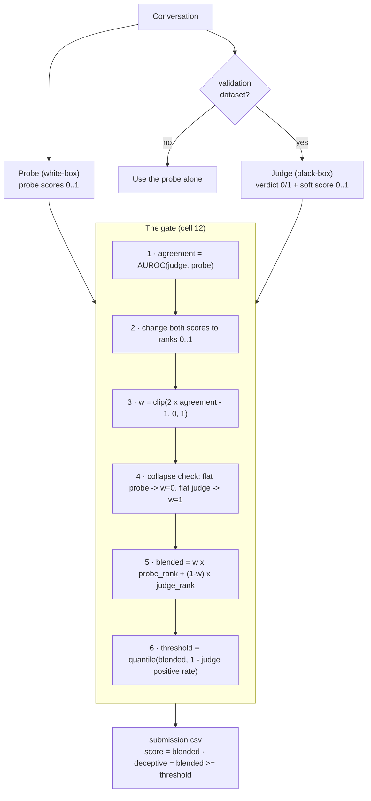

# sonic_v2.2

This document tells you how sonic_v2.2 combines two deception detectors into one
submission. 

**In one line:** sonic_v2.2 rewrites the gate in cell 12. The gate blends a
white-box probe and a black-box judge. Cells 1 to 11 do not change.

---

## The two detectors

sonic_v2.2 uses two detectors.

- The **probe** reads the model activations. It is a white-box detector. It
  gives a score between 0 and 1.
- The **judge** reads the model text. It is a black-box detector. It gives a
  verdict (0 or 1) and a soft score between 0 and 1.

The probe runs on all datasets. The judge runs only on validation datasets.

The submission has two columns.

- **score** — one number for each row. It sets the AUROC.
- **deceptive** — a 0 or a 1 for each row. It sets the balanced accuracy.

The gate makes both columns.

---

## Why the gate is simple

The gate has two detectors and no labels. It cannot know which detector is more
accurate. It knows only if the two detectors agree.

The agreement is one number:

```
agreement = AUROC(judge verdicts, probe scores)
```

The agreement is symmetric. A high value shows that the two detectors agree. It
does not show which detector is correct.

The gate cannot select the better detector. The gate blends the two detectors
instead. This is the honest limit for two detectors.

There is one exception. A detector can give almost the same output for every
row. This detector has no signal. The gate finds this condition without labels.
In this condition the gate uses the other detector alone.

---

## The gate flow



---

## The gate steps

The gate does these steps for each validation dataset.

**Step 1 — Measure the agreement.**
The agreement is the AUROC of the probe scores against the judge verdicts. It
shows how often the probe puts the judge's deceptive rows above the judge's
honest rows. A value of 1.0 means the two detectors agree in full. A value of 0.5
means they do not agree at all. A value below 0.5 means the probe ranks in
reverse order. In this condition, replace each probe score with (1 − score). The
agreement is now between 0.5 and 1.0.

**Step 2 — Change the scores to ranks.**
A rank is the position of a row in the sorted order, from 0 to 1. The lowest
score becomes 0. The highest score becomes 1. The probe scores and the judge
scores bunch up in different places. Ranks put both detectors on the same even
scale. Then the weight in step 3 controls the blend.

**Step 3 — Set the trust weight.**
The weight `w` sets how much the gate trusts the probe. The gate trusts the probe
more when the probe agrees with the judge more. This formula sets the weight:

```
w = clip(2 x agreement - 1, 0, 1)
```

- `w = 0` uses the judge alone. This occurs at agreement 0.5.
- `w = 1` uses the probe alone. This occurs at agreement 1.0.
- A value between gives a mix. Agreement 0.75 gives `w = 0.5`.

The line is smooth. It has no step and no tuned constant.

**Step 4 — Do the collapse check.**
A detector can give almost the same score to every row. This detector has no
signal. If the probe scores are almost constant, set `w = 0`. If the judge scores
are almost constant, set `w = 1`. This is the only safe way to select one
detector without labels.

**Step 5 — Blend the ranks.**
This step makes one combined rank for each row. The combined rank is a weighted
average of the two ranks:

```
blended = w x probe_rank + (1 - w) x judge_rank
```

A high `w` follows the probe. A low `w` follows the judge. The `blended` value is
the `score` column.

**Step 6 — Set the threshold.**
The `blended` value is continuous. The `deceptive` column must be 0 or 1. So the
gate needs a cut point.

First, count how many rows the judge calls deceptive. This fraction is the
positive rate. Keep the rate between 0.05 and 0.95.

Then set the cut point so that the same fraction of rows stays above it:

```
threshold = quantile(blended, 1 - positive_rate)
```

The rows with the highest `blended` values go above the cut point. The judge sets
how many rows are deceptive. The blended rank sets which rows are deceptive.

**Step 7 — Write the submission.**

- `score` = blended
- `deceptive` = 1 if blended ≥ threshold. If not, `deceptive` = 0.

---

## What the gate does not do

- It does not train on data. All values come from the detector outputs.
- It does not use a confidence value for each row. The probe score is not
  calibrated. A score of 0.5 is not always the boundary between honest and
  deceptive. A distance from 0.5 is therefore not a true confidence.
- It does not change cells 1 to 11.
- On a non-validation dataset, it uses the probe alone.

---

## What the gate repairs

The old gate scores 0.7471 balanced accuracy. This value is below the judge
alone (0.8333). Two rows cause the problem. The new gate repairs both rows.

| Row | Old BA | New BA | Reason |
|-----|--------|--------|--------|
| Notus / Qwen | 0.57 | ~0.71 | The probe is almost random. So `w` is near 0. The gate uses the judge. |
| Iris / Gemma | 0.51 | ~0.93 | The probe ranks well but its threshold is wrong. The new threshold repairs it. |

The new BA values are projected, not measured. Run v2.2 on Notus and Iris to
confirm them.

---

## The limit

A blend of two detectors always lands between the two detectors. The best blend
of our probe and our judge reaches about 0.84 BA. The best white-box method on
the board (Tiresias) reaches 0.89 BA. That method has a better probe on Notus. A
better gate cannot repair a weak detector. A better probe is the next step.
