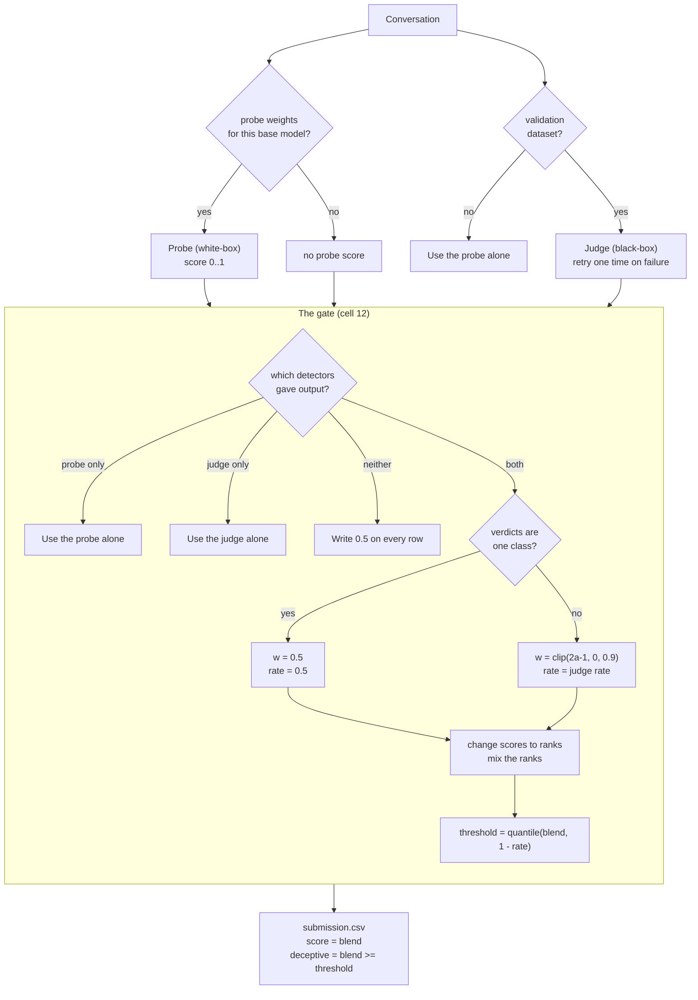

# sonic_v2.3 (and v2.3.5)

This document tells you how sonic_v2.3 works. You do not need to read the
documents for the earlier versions.

**In one line:** sonic_v2.3 mixes a white-box probe and a black-box judge into
one submission. It changes the gate in cell 12, the judge retry in cell 11, and
the fallback values in cell 3. Cells 4 to 10 do not change.

**sonic_v2.3.5** is a small follow-up to sonic_v2.3. It keeps all the sonic_v2.3
logic below and adds two safety fixes. Fix 1: the probe-alone fallback no
longer uses a null threshold. Fix 2: the judge retry now checks the remaining
time budget, not a fixed 600-second rule. Read the section **"What changed in
v2.3.5"** first. The rest of this document still describes the shared gate.

The submission notebook is `legacy_submissions/sonic_v2.3.5.ipynb`. The original
`sonic_v2.3.ipynb` file is in `legacy_submissions/`.

---

## What changed in v2.3.5

We submitted sonic_v2.3. It scored BA `0.7754` and AUROC `0.8761`. This is a
regression from sonic_v2.1 (`0.8471`). One test unit caused the whole drop.

| Row | v2.2 | v2.3 |
|-----|------|------|
| Iris / gemma | 0.9700 | **0.5000** |

The Iris / gemma unit fell to `0.5000`. Its recall was `0` and its FPR was `0`.
Its AUROC stayed at `0.9911`, so the probe still ranked the rows in the correct
order. The threshold marked every row as not deceptive.

**The cause.** The judge failed on that one unit. Thus the gate used the probe
alone (step 1, row "yes / no"). The old probe-alone path read the threshold from
the probe config with `config.get("threshold", THRESHOLD)`. The probe configs
store `"threshold": null`. The key is present, so `.get` returns the `null`
value, not the default value. Then `deceptive = score >= None` marks every row
`0`. On Iris the probe has a strong order (AUROC `0.9911`). Thus a null
threshold wasted a strong detector. This fault was present in v2.1 and v2.2 too.
They avoided it on this unit only because their judge did not fail on this
unit.

**Fix 1 — the probe-alone threshold.** When the judge is absent, the gate now
splits at the **median of the probe's own scores**, not at the null config
value. A median split can never mark every row one class. Half the rows fall
on each side, so the decision column always follows the probe's order. On a
strong probe, this turns a good order into a good balanced accuracy.
sonic_v2.3.5 adds the same guard to the exception path at the end of cell 12.
This fix changes step 1 (row "probe yes, judge no") and the fallback only. It
does not change the main "both detectors" gate.

**Fix 2 — the judge retry checks the time budget.** See the revised "The
judge retry" section below. The gate no longer refuses a retry after a slow
first attempt, on a fixed 600-second rule. It checks the remaining
wall-clock budget instead.

**What to expect from v2.3.5.** We expect the Iris / gemma unit to recover
from `0.5000` to about `0.93`, the level its AUROC allows. We expect the
headline balanced accuracy to return to about `0.847`, level with sonic_v2.1.
The AUROC stays at `0.8761`. This is the best AUROC of any sonic run. AUROC
does not change, because it reads the score column. The score column was
already correct. Only the balanced accuracy moves. It moves only on units
where the judge fails and the probe is strong.

**What v2.3.5 does not do.** It does not stop the judge from failing. It
stops a failure from breaking the run, but the failure can still happen. On a
unit where the judge fails, you get the bare probe score (`~0.93`), not the
full probe-plus-judge mix (`~0.97`). You must close that last gap with
reliability work, not a threshold change.

---

## The two detectors

sonic_v2.3 uses two detectors.

- The **probe** reads the activations of the model. It is a white-box detector.
  It is a transformer token probe at decoder layer 46. It gives a score between
  0 and 1.
- The **judge** reads the text of the model. It is a black-box detector. It is
  `Qwen3.5-9B` with a LoRA adapter. It gives a verdict (0 or 1) and a soft score
  between 0 and 1.

The probe needs weights for the base model of the dataset. There are weights for
gemma, Qwen and Nemotron. The probe cannot run on a different base model.

The judge runs only on validation datasets. The name of the dataset controls
this. Only a name that starts with `validation-` is a validation dataset. The
environment variable `SONIC_FORCE_JUDGE=1` also starts the judge, for local
tests.

The judge is black-box. It reads only text. Thus the judge can run on a base
model that has no probe weights.

---

## The two output columns

The file `submission.csv` has two columns.

- **score** — one number for each row. It sets the AUROC.
- **deceptive** — a 0 or a 1 for each row. It sets the balanced accuracy.

The gate makes both columns.

---

## Why the gate mixes the detectors

The gate has two detectors and no labels. It cannot know which detector is more
accurate. It knows only if the two detectors agree.

The agreement is one number:

```
agreement = AUROC(judge verdicts, probe scores)
```

The agreement is symmetric. A high value shows that the two detectors agree. It
does not show which detector is correct. Thus the gate cannot select the better
detector. The gate mixes the two detectors instead.

---

## Why we made v2.3

sonic_v2.1 has a score of 0.8471. sonic_v2.2 has a score of 0.8104. sonic_v2.2
has the lower score, but its gate is better.

Only one row causes the difference.

| Row | v2.1 | v2.2 |
|-----|------|------|
| Notus / Nemotron | 0.7525 | 0.5025 |
| Notus / Qwen | 0.6950 | 0.6950 |
| Notus / gemma | 0.7575 | 0.7575 |
| Iris / Nemotron | 0.9450 | 0.9525 |
| Iris / Qwen | 0.9500 | 0.9850 |
| Iris / gemma | 0.9825 | 0.9700 |

On the Notus / Nemotron row, sonic_v2.2 gives the same numbers as sonic_v1. This
tells us that the gate used the probe alone on that row. The probe has no signal
on Notus. Thus the score fell to 0.5025.

On the other rows, sonic_v2.2 is equal to sonic_v2.1 or better than it. The Iris
rows of sonic_v2.2 are the best rows on the leaderboard.

So the gate of sonic_v2.2 is correct. The fault is the path that throws the
judge away. sonic_v2.3 keeps the good gate and removes that path.

---

## The gate, step by step

The gate does these steps for each validation dataset.

### Step 1 — Find which detectors are available

The gate first tests which detectors gave output.

| Probe | Judge | What the gate does |
|-------|-------|--------------------|
| yes | yes | Mix the two detectors. Go to step 2. |
| yes | no | Use the probe alone. (v2.3.5: split at the median of the probe scores, not the null config threshold.) |
| no | yes | Use the judge alone. Rank its soft scores. |
| no | no | Write 0.5 on every row. |

**New in v2.3, part 1.** sonic_v2.2 used the probe alone if all judge verdicts
were 0, or if all were 1. That path is now removed. Only the hard verdicts are
one class in that condition. The soft scores of the judge can still put the rows
in a good order. The probe is also at its worst on such data.

**New in v2.3, part 2.** sonic_v2.2 skipped cells 4 to 12 if the base model had
no probe weights. It then wrote 0.5 on every row, and the score for that dataset
was 0.5. This also stopped the judge, which did not need the probe. sonic_v2.3
starts the judge in this condition. A hidden dataset with a new base model thus
gets a real score.

### Step 2 — Measure the agreement

The agreement is the AUROC of the probe scores against the judge verdicts. A
value of 1.0 means that the two detectors agree fully. A value of 0.5 means that
they do not agree.

A value below 0.5 means that the probe ranks in the reverse order. In this
condition, replace each probe score with (1 − score). The agreement is then
between 0.5 and 1.0.

The agreement needs both verdict classes. If all verdicts are one class, the
gate cannot measure it.

### Step 3 — Set the trust weight

The weight `w` sets how much the gate trusts the probe.

```
w = clip(2 x agreement - 1, 0.0, 0.9)
```

- `w = 0` uses the judge alone. This occurs at agreement 0.5.
- `w = 0.9` is the maximum trust in the probe.

**New in v2.3.** The upper limit of 0.9 is new. sonic_v2.2 let the weight go to
1.0, which uses the probe alone. The limit is on one side only. A weight of 0.0
is still possible, because the judge alone is correct when the probe has no
signal. A weight of 1.0 is not possible, because the probe is the detector that
fails on new data. The probe was at chance on all three Notus rows.

If all judge verdicts are one class, the gate cannot measure the agreement. It
then uses `w = 0.5`. This gives the two detectors an equal weight.

### Step 4 — Change the scores to ranks

A rank is the position of a row in the sorted order, from 0 to 1. The lowest
score becomes 0. The highest score becomes 1.

The probe scores and the judge scores group in different places. The probe uses
a sigmoid and the judge uses a softmax. Ranks put both detectors on the same
scale. The weight in step 3 then controls the mix.

Ranks also make a guard unnecessary. A detector with no spread gets the same
rank of 0.5 on every row. The mix then stays in the same order as the other
detector. Thus a flat detector does no damage.

**New in v2.3.** sonic_v2.2 had a degeneracy guard. The guard tested if the
spread of a detector was less than 1e-6, and then removed that detector. The
guard is now removed. It could never operate, because it was inside a branch
that already had both judge classes. It was also not necessary, for the reason
above.

### Step 5 — Mix the ranks

This step makes one combined rank for each row.

```
blended = w x probe_rank + (1 - w) x judge_rank
```

A high `w` follows the probe. A low `w` follows the judge. The `blended` value
is the `score` column.

### Step 6 — Set the threshold

The `blended` value is continuous. The `deceptive` column must be 0 or 1. Thus
the gate needs a cut point.

First, find the rate of rows that the judge calls deceptive. Hold this rate
between 0.05 and 0.95. Then set the cut point:

```
threshold = quantile(blended, 1 - rate)
```

The judge sets how many rows are deceptive. The mixed rank sets which rows are
deceptive.

**New in v2.3.** If all judge verdicts are one class, the rate of the judge has
no information. Use a rate of 0.5 instead. sonic_v2.2 held the rate at 0.05 in
this condition, and thus marked only 5 percent of the rows.

---

## The judge retry

**New in v2.3.** If the judge fails, sonic_v2.3 starts the judge one more time.

A lost judge costs approximately 0.04 of the score. This is much more than any
change to the gate gives.

**Changed in v2.3.5.** sonic_v2.3 did not start the judge again if the first
try took more than 600 seconds. That rule was too strict. The sandbox gives
one wall-clock budget for the whole run (`NOTEBOOK_BUDGET`, 1800 seconds by
default). A run of this size uses about 970 seconds per dataset. So the run
usually has much budget left after one failure. The old rule refused a retry
after a slow failure, even when half an hour of budget remained.

sonic_v2.3.5 checks the **remaining budget** before it retries. Cell 1
records `NB_START` at the start of the run. After a failure, the gate
measures how long the attempt took and how much budget is left. It retries
once, only when the budget still covers a second attempt plus a margin:

```
budget_left = NOTEBOOK_BUDGET - (now - NB_START)
retry if attempt == 0 and budget_left > (attempt_duration + margin)
```

So the gate now retries after a slow failure, when the budget allows it. A
retry can never push the run over the limit. This limit matters, because the
sandbox kills the whole process group when the run hits it. The first such
failure aborts the **entire** submission, not just that one dataset. The
margin defaults to 180 seconds. Both values are environment variables:
`NOTEBOOK_BUDGET_SECONDS` and `JUDGE_RETRY_MARGIN_SECONDS`.

---

## The telemetry line

**New in v2.3.** sonic_v2.3 prints one line for each dataset. The line has these
values:

- `judge_ok` — the judge gave output
- `single_class` — all judge verdicts are 0, or all are 1
- `agreement`
- `w`
- `positive_rate`
- `threshold`

Before this change, we had to guess the cause of a failure from the run time.

---

## The gate flow



---

## Test results

We ran the gate of sonic_v2.3 on five test conditions. The data was synthetic.

| Condition | AUROC | Bal. Acc | Note |
|-----------|-------|----------|------|
| Good probe, good judge | 1.000 | 0.985 | The limit of 0.9 does no damage. |
| Probe at chance, good judge | 0.992 | 0.955 | `w` fell to 0.090. The judge did the work. |
| Judge verdicts one class | 0.866 | 0.740 | sonic_v2.2 gives approximately 0.50 here. |
| No judge | 1.000 | 1.000 | The probe alone is the correct fallback. |
| Judge soft scores flat | 1.000 | 0.985 | The mix needs no guard. |
| No probe weights | 0.995 | 0.955 | sonic_v2.2 gives 0.50 here. |
| No probe and no judge | — | — | Writes 0.5 on every row. |
| No dataset | — | — | Writes an empty file. |

The third and sixth rows show the gain from step 1. The fifth row shows that the
removal of the guard in step 4 is safe.

---

## What sonic_v2.3 does not change

- It does not change the probe. The weights are the same.
- It does not change the judge model or the judge prompt.
- It does not change cells 4 to 10. In cell 3 it only adds fallback values.
- It does not add a third detector.
- It does not use a confidence value for each row. The probe score is not
  calibrated. Thus a distance from 0.5 is not a true confidence.
- On a dataset that is not a validation dataset, it uses the probe alone.

---

## What happened (result confirmed)

sonic_v2.3.5 was submitted on 2026-07-24 at 19:22. It scored balanced accuracy
`0.853750` and AUROC `0.876333`. This is our best official submission on both
metrics.

The fix worked, and it did nothing else.

| Row | v2.3 | v2.3.5 |
|-----|------|--------|
| Iris / gemma | **0.5000** | **0.9700** |
| every other counted unit | — | unchanged to four decimals |

We projected the Iris / gemma unit would recover to about `0.93`. It reached
`0.9700`. We projected a headline balanced accuracy of about `0.847`. It reached
`0.8537`.

The AUROC moved from `0.8761` to `0.8763`. This is almost flat. The reason is
simple. The Iris / gemma order of rows was already near-perfect at `0.9911`. The
bug was a threshold bug only. It never damaged the order.

Run time was 85 minutes (`5124s`). v2.3 took 65 minutes (`3896s`). The extra
time is normal run-to-run variation on the judge pass, not a cost of the fix.

---

## The limit

These changes protect the score. They do not make the probe better on new data.

The gap to the first team is on Notus only. Our AUROC values on Notus are
`0.6900`, `0.7572` and `0.8259`. The first team has `0.9056`, `0.9326` and
`0.8715`. On Iris we are in front of the first team on both metrics.

Five gate versions have now been scored. Every Notus unit is identical across
v2.1, v2.2, v2.3 and v2.3.5 on both metrics. The gate work only ever moved Iris.
This is strong evidence. Notus is limited by the detectors, not by the gate.

A mix of two detectors always stays between the two detectors. No gate can
repair a bad order of rows. The next step is a third detector, or a probe that
transfers better. Test both offline before you send them.

To reach the first team we need Notus AUROC `0.7577 -> 0.8952`. Our Notus
balanced accuracy is already close to the best value possible at our Notus
AUROC. So there is one target, not two. Fix the order of rows on Notus and the
balanced accuracy follows.
